# Impact of each finding

Runtime check of the twelve findings, on 2026-09-29. The pictures are the game's own window: `EM_CAPTURE` opens the level off-screen, waits until the verdict is in (`EM_WAIT=1`), and saves a screenshot. The flights that no shipped file contains were integrated with `generator trace` on JSON in `scenarios/`. Nothing under `crates/`, `levels/`, or `PHYSICS.md` was edited.

`EM_TIME` is applied after the animator. A time past the end of the flight is wrapped back to 0 before the frame is drawn, so a late beam has to be requested inside the flight. On level 46 the flight ends between t = 25 and t = 28.

## 1. Stray fields missing from the potential and magnetic maps

**The ions fly the crossed-field motion, and the map the level tells you to read does not contain that field.**

Level 57's text says the guiding centres follow the equipotentials and says to look at the potential map. With no player charge the positive ion leaves the arena at t = 98.013 (`LeftBounds` in `results/level57_empty_trace.txt`). Its cycloid stays between y = 10.00 and y = 11.75, so the loops are 1.75 cells tall, and the energy error on that flight is 4.8×10⁻⁸. The potential bar sits on zero. The map is one flat red: the shader potential is 0, and the colour zero was taken from the real launch potential, which shifts the whole arena by about 10⁴ launch energies. "Show all" is on by default, so the dark mask is the minimum of the two ions and disappears. There is no horizontal equipotential to follow.

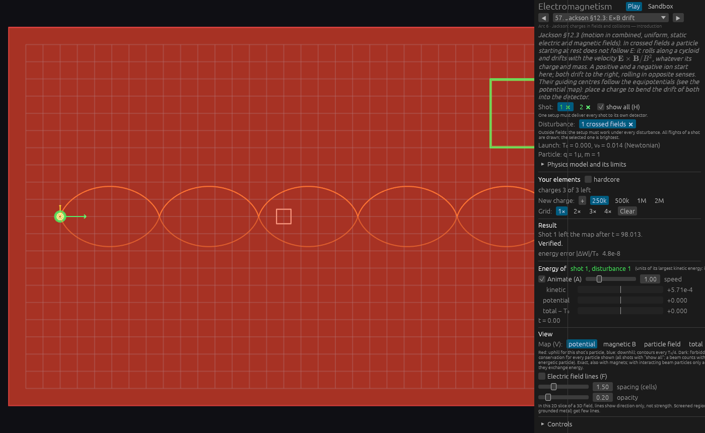

The magnetic map is the same blank grid. `B_z / b_ref = 117`, so a map that included the disturbance would be painted far past the "5-cell gyroradius" unit. The loops on the screen are the evidence that `B_z` is in the flight.

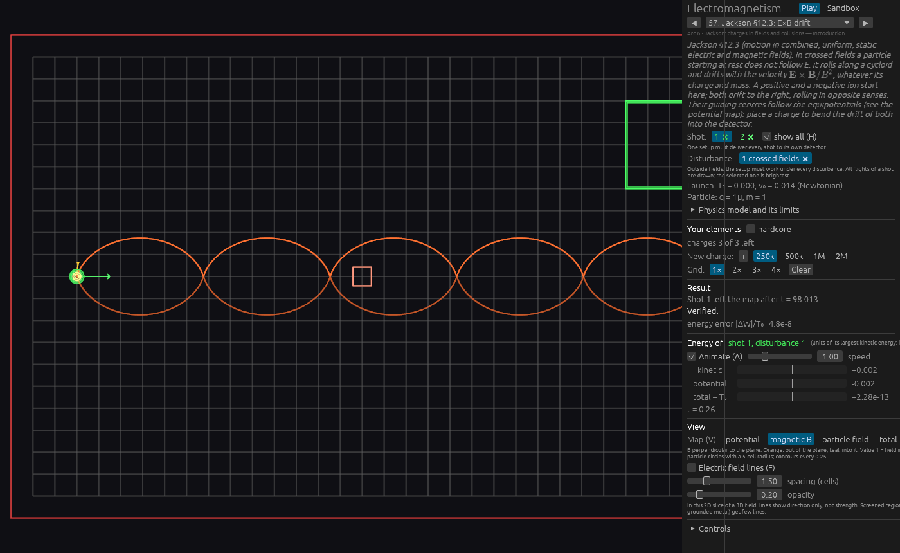

The total view samples the flight's field. It draws a uniform upward `E`, full colour at `|E| = 1.00×10⁵`, and the energy total at the start of the flight is 2.6×10⁻¹³. Field lines stay absent: with no charge, no metal and no electrode the line routine returns immediately.

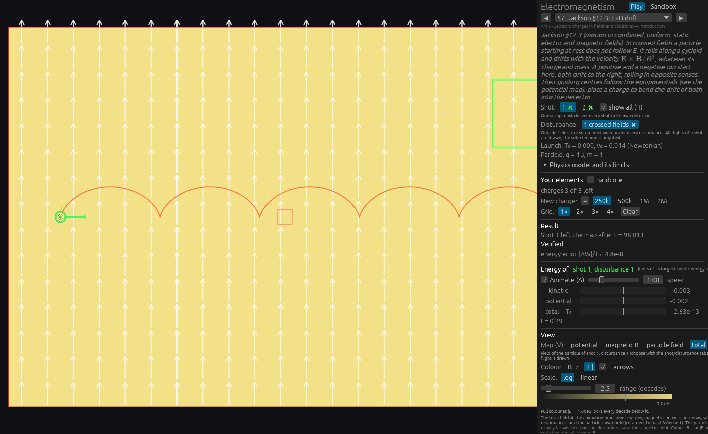

The reference charge (the solved level, both shots verified, energy error 2.3×10⁻⁷) adds that charge's circles and its field lines. The background stays the flat red. The solved flight runs from y ≈ 10 up to y = 16.53 and into the detector (`results/level57_trace.txt`, end `Arrived` at t = 134). Those circles are not the equipotentials of `E` plus the charge.

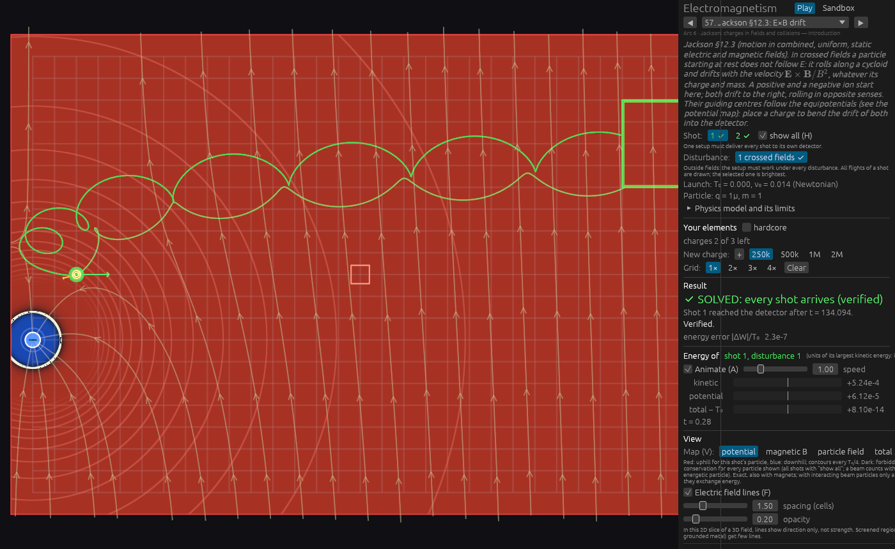

The same empty-map arithmetic, not re-photographed, is in `results/checks.txt` for levels 63, 66, 82, 86 and 87. Levels 36, 40, 41, 45 and 62 keep the map on disturbance 0 while the selected flight can be another one; the capture has no switch for the disturbance, so those were not opened.

## 2. Charge-cloud map is a point charge

**The electron circles in the uniform sphere. The map draws the 1/r well, and its turning line sits outside the orbit.**

Level 76, no player charge. The flight runs to the time limit (t = 300) with energy error 5.5×10⁻¹⁰, so the integrated potential is the sphere. On the potential map the orbit lies inside a bright ring: the turning contour of `Q/r`, at 3.20 cells from the centre against the orbit's 2.83 (`results/checks.txt`). The legend calls that contour exact.

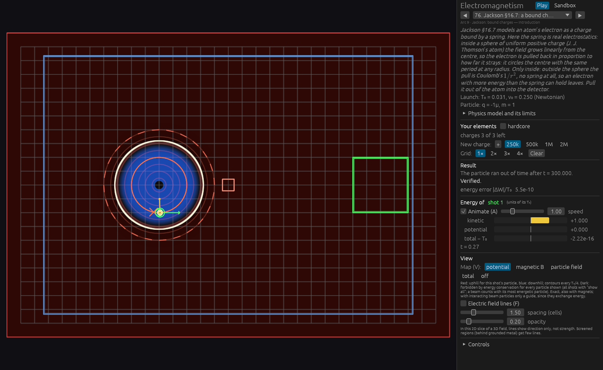

The total `|E|` of the same flight is dark at the centre and brightest at the sphere's surface. Full colour is `|E| = 5.88×10⁴`; the surface field of this cloud is `Q/R² = 6.25×10⁴`. That is the field the orbit uses. The potential map has no such hole at the centre: the point-charge potential is largest there, and the shader clamps it at `Q/10⁻⁴` under a disk of radius 0.3.

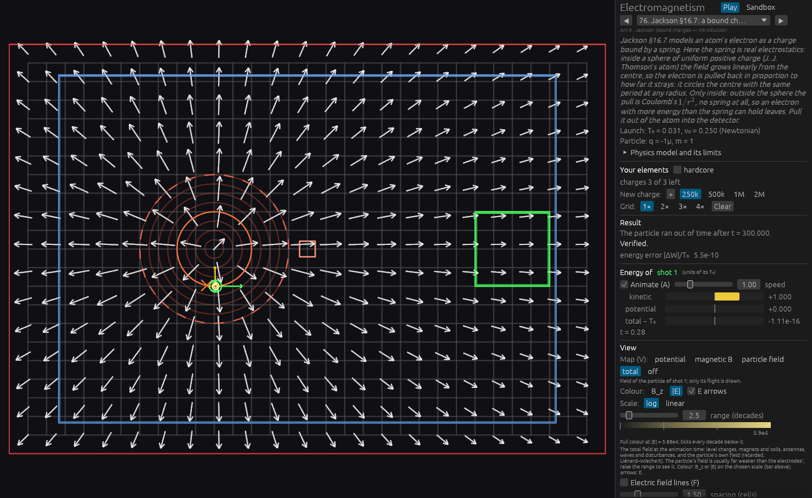

Level 77 launches the electron at the centre. It stays bound until the time limit (t = 400), energy error 6.6×10⁻¹⁰, max v/c = 0.025. The map puts the false disk on the launch point and draws the point-charge well. The real turning radius is 1.00 cell; the map's is 2.72 (`checks.txt`). A player tuning the antenna is shown a spring that reaches almost three times as far as the flight.

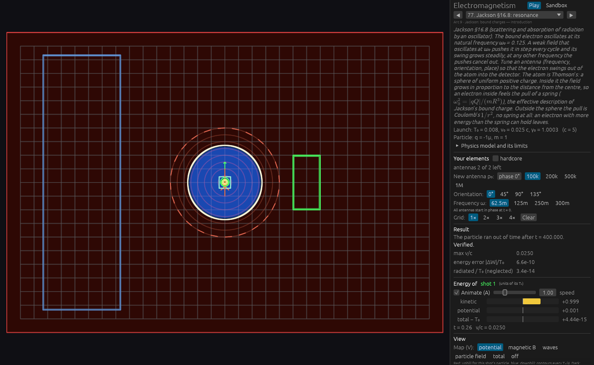

## 3. A static antenna stores a zero potential

**The particle flies the dipole orbit, and the energy diagnostic scores the missing potential as a violation of energy conservation.**

No shipped antenna has ω = 0, so this is `scenarios/static_antenna.json`, integrated by `generator trace` (`results/static_antenna_trace.txt`). Dipole `p = (0, 2)` at (12, 11), Newtonian, launch T₀ = 0.5. The particle curves past it and arrives at t = 20.787.

Kinetic energy on that path swings by **+0.480 T₀** (t = 10.983, `|p| = 1.217`). The electrostatic potential `φ = n·p / r²` brings `T + qφ` back: over the 24 printed samples the largest leftover is 1.2×10⁻⁵ of T₀, which is the size of printing x and y to four decimals. The code stores `φ = 0` and, because the antenna is static, the diagnostic integrates `W = T + qφ`. It would report an energy error of about half the launch energy on a flight that conserves energy. The force itself uses `E`, which is why the path is the dipole orbit.

An oscillating antenna is unaffected: the diagnostic is then `n/a`, which is what the RF levels show.

## 4. Moment bans ignore clouds and free-particle moments

**A neutral moment flies straight through the cloud's electric field, and the flight is counted as an arrival. Save does not warn.**

`scenarios/moment_cloud.json`: moment 1, charge 0, c = 5, cloud charge 50 and radius 2 at (12, 11), launch at y = 8 so the closest approach is 3 cells, outside the cloud. `results/moment_cloud_trace.txt`: y stays 8.0000 on every sample, `|p|` stays 1.004988, outcome `Arrived` at t = 21.314.

The same numbers, to the printed digits, come from a point charge of 50 at the same place (`results/moment_charge_trace.txt`). The Aharonov–Casher force is absent in both. The difference is the warning. `Level::model_issues` adds it when a **shot** moment shares a level with an electric source it knows about (`max_charges`, elements that are not magnets, antennas, plates, conductors, electrodes, a disturbance `E`). A cloud is not in that list, and a moment on `free_particles` is not a shot moment. The warning is attached in `sandbox.rs::save`, as a line in the save status. It does not stop the integration. A cloud-only level therefore saves with the warning absent, and the moment still ignores `E`.

No shipped file has a free particle. The moments in levels 29 and 47 are shot moments with no electric source, which is the case the force law covers.

## 5. Electrode maps are point charges

**The graded flight uses the plate. The field lines on the potential map leave the plate as if the charge sat at its centre. The legend says the map is exact.**

Level 19 with the reference supply, `V = −120 k` on the upper plate. The particle reaches the detector at t = 27.327, verified, energy error 4.5×10⁻¹¹, neglected radiation 4.8×10⁻¹⁷, neglected electrode image force ≤ 6.1×10⁻¹³. The trajectory's treatment of the plate is consistent at that level.

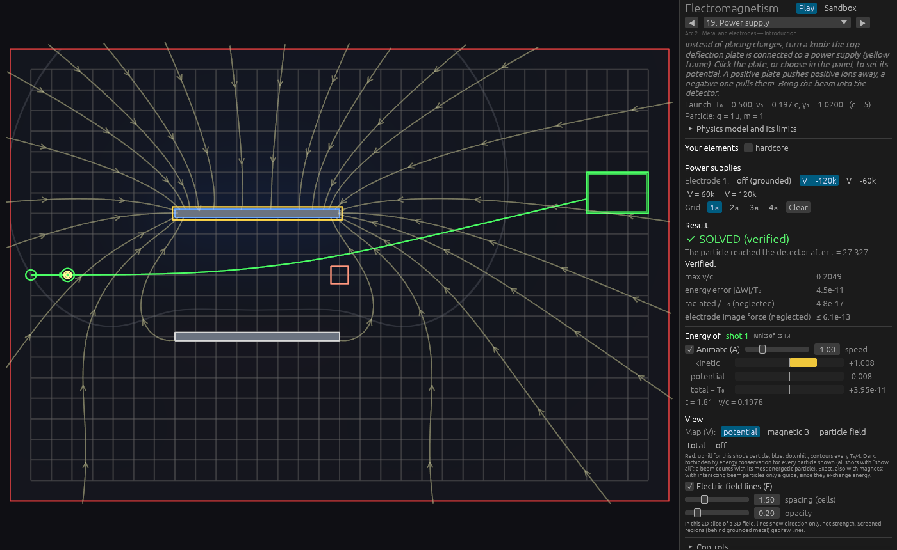

The lines on that map spray out from the plates. The total `|E|` of the same flight is a smooth field between the two bars, full colour `|E| = 2.87×10⁴`, and the path is the same curve. Far from a plate the monopole is the right first term, which is why the bend still looks reasonable and the level solves. On the plate the picture is the centroid spike.

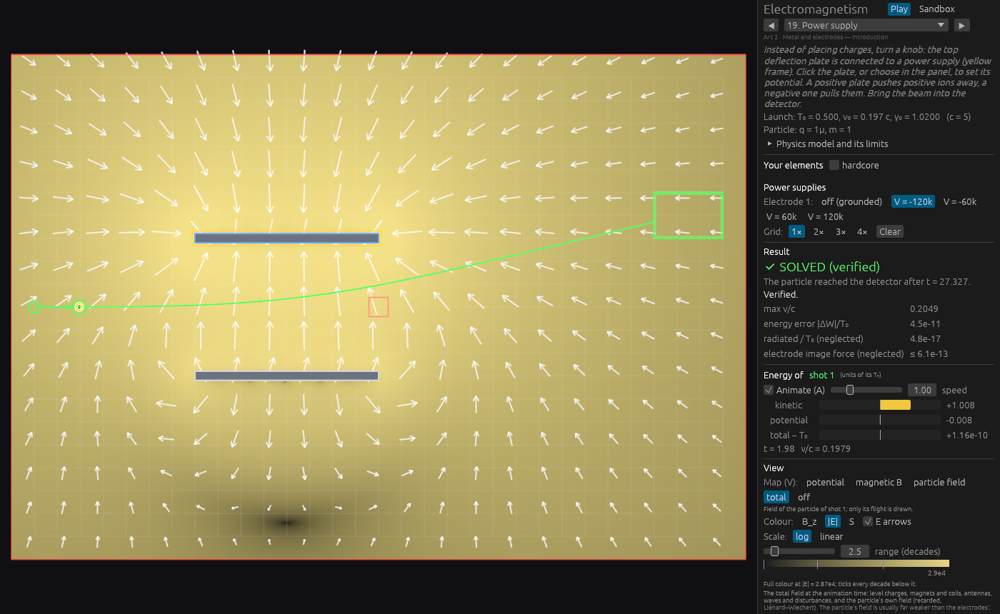

## 6. Sentences the implementation has left behind

These do not move a particle. Each one tells the next edit the wrong fact. The runtime above is what contradicts them.

| Sentence | What the run shows |
|---|---|
| `PHYSICS.md` §2.1, the cloud map needs nothing new | Level 76: the orbit and the map's turning ring disagree, energy error 5.5×10⁻¹⁰ |
| §2.4, infinite-c antenna is the electrostatic dipole | The dipole orbit above, with `φ` stored as 0 and `T` swinging by 0.48 T₀ |
| §3.2, the map is `q(φ−φ_A) − m(B_z−B_{z,A})`, and every moment-plus-electric case is rejected | Level 57's flat red map; the cloud moment arrives with no warning |
| §3.3, the books balance by construction, and the tapered past changes by at most 0.1c so it stays below c | Level 46's total walks to −2.2×10⁻⁴ while the caption says it is conserved. The 0.1c shift reaches c for a pure brake at β = 0.9 (`checks.wls`); the shipped launches sampled below do not |
| §3.3, `model_issues` rejects beam radiation reaction, and contact is not an event | No new run. The section's own collision paragraph already describes the impulse, and beam radiation reaction is implemented |
| §4, `energy_max_abs_error` is `\|W(t)−W(0)\|` with `W = (γ−1)mc² + qφ` | The panel's "energy error" on these static flights is 10⁻⁸ to 10⁻¹⁰, which is the closure the runner actually stores |
| §6, `Trajectory::closest_sampled` | No such field. Not exercised here |
| `beam.rs` header and the step-cap comment | Comments only |
| `External::sample` on an ω = 0 wave, "B = 0" | No shipped wave has ω = 0. The transcription in `checks.txt` gives `\|B\| = \|E\|/c` |
| Panel note, jump `±2πσ` | The integral and its test use `4πσ`. The flights are unaffected |
| Preview and verification differ only for metal spheres | Not re-run |
| Mixing a beam shot with a single shot is rejected | Not re-run. A non-beam shot in a beam level flies as one particle |

## 7. Latent disagreements

Nothing here is reachable from a shipped file, and none of it was provoked in the capture. The impact, if a sandbox or a later caller hits it:

- **`FieldMotion::Retarded.t`** stores emission time minus observer time. A caller that treats it as an absolute emission time is off by the observer's t. The field formula does not read it.
- **Landau–Lifshitz skips the image field.** On a metal level with radiation reaction the reaction force would miss a smooth piece of the field the particle actually feels. No shipped radiation-reaction level has metal.
- **A NaN event endpoint is a clear interval in release.** A zero-length ramped segment is one way to produce one; the particle would then pass the boundary.
- **The particle-field view rebuilds acceleration without the image force and without radiation reaction.** The drawn path is the integrated one. The `β̇` of the Liénard picture is not, on any level that has metal or radiation reaction.
- **Antenna and wave phase loses low bits in f32** after a long light-travel phase. Shipped arenas are tens of cells.
- **A repeated polygon vertex on a ramped coil makes the induced `E` NaN everywhere.** The editor's "+ vertex" copies the last vertex, so one extra click on a ramp does it. Shipped coils have distinct vertices.
- **Overlap checks add a hardcoded 0.3.** A sandbox body whose radius is not 0.3 can sit inside metal while Save's issue list stays empty. Contact during a flight uses the particle's own radius.

## 8. Limits already stated in PHYSICS.md

These are the model's stated approximations. The runs here do not reopen them. On level 19 the neglected electrode image force is ≤ 6.1×10⁻¹³ of the force that matters, which is the bound the panel prints. The Faraday cup as a pipe, and the quasi-static beam, are the same class. The energy total in finding 12 is a separate defect: the panel claims conservation on top of the pipe model.

## 9. Caps and a divergent helper

A sandbox past 1024 charges, 64 magnets, 16 loops or 64 segments draws the prefix and does not say so. No shipped level is near those caps, and this pass did not build one. `PlaneWave::vector_potential` divides by ω; the flight does not call it. The static scan is unchanged.

## 10. A launch already inside the detector is an arrival

**The particle is scored as arrived at t = 0, without crossing the gate and without the energy the detector asks for.**

`scenarios/launch_inside_detector.json`, `results/launch_inside_trace.txt`. Launch node (10, 8) inside the detector box (8, 6)–(14, 12), kinetic energy 0.5, acceptance window [10, 20], and a gate at (1, 1)–(3, 3). One sample, `end Arrived t = 0.000`.

A flight that enters the detector during the integration still goes through the gate and acceptance checks. The hole is the launch state. No shipped launch is inside its detector or a gate; the closest is 2 cells out, on level 58 shot 1. The editor can drag the detector over the launch, and Save does not list this.

## 11. The tapered past can go faster than light

**The bound used to justify the taper is false. The shipped launches sampled here still stay under c, because their launch acceleration is perpendicular to the velocity or is zero.**

`generator trace` on the reference solution:

| level | what `|p|` does at launch | consequence for a 0.1c shift along the acceleration |
|---|---|---|
| 80 Beaming, 85 Braking | stays 5.656854 while the particle crosses from x = 2 (`β = 0.943`, c = 2) | 85 has no elements, so the past is uniform motion at `β`. 80's magnet is far from the launch; a purely transverse 0.1c gives `√(0.943² + 0.1²) c = 0.948 c` |
| 30 Beta-ray spectrometer, shot 0 | stays 2.197368 through the bend (`β = 0.910`) | magnetic force is perpendicular to `v`, same transverse bound, `0.916 c` |

The fastest shipped beam edge is `β = 0.805` on level 48. Even a pure brake, which adds the whole 0.1c, ends at `0.905 c`. A pure brake crosses c at `β = 0.9`, and inside the constant-acceleration piece at `β = 0.93`. That is a beam, or a single particle, whose launch acceleration points against its velocity. None of the three fast reference flights above is that case. The integrated state is a momentum and cannot exceed c either way. The synthetic past used by the beam interaction and by the field view before launch is what can.

## 12. Cup fade work is missing from the energy total

**On the solved space-charge beam the paths are right, 16 of 16 arrive, and the total the panel says is conserved moves by 2×10⁻⁴ of the launch energy once particles enter the cup.**

Level 46, reference charge, Newtonian, interacting. The result line reports an energy drift of 1.4×10⁻¹². That diagnostic resets while a fade is active. The bars underneath do not.

At t = 20 nobody has been absorbed. Kinetic +1.498, potential −0.497, mutual −0.002, absorbed 0, total − T₀ = +2.1×10⁻¹². The caption says the total is conserved, and here it is.

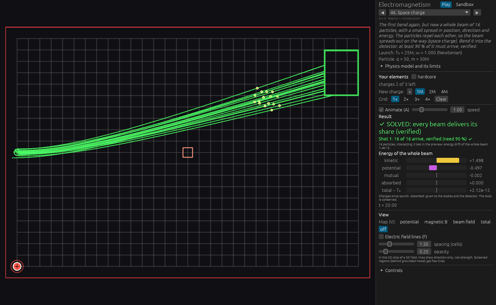

At t = 23 the first particles are inside the detector. Absorbed is +0.109 and the total is still +1.8×10⁻¹²: booking the energy at the instant of entry balances.

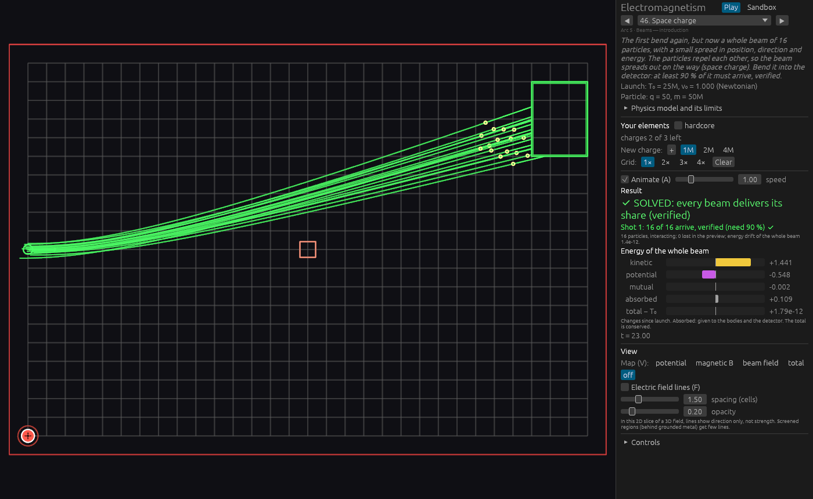

At t = 24 absorbed is +0.622 and the total is **−8.1×10⁻⁵**. At t = 25 absorbed is +1.494, kinetic has fallen to +0.263, and the total is **−2.2×10⁻⁴**. The caption still says the total is conserved, and the result line still says 1.4×10⁻¹². The paths stay the solved ones. The drift is the work the fading charges do on the survivors after the booking.

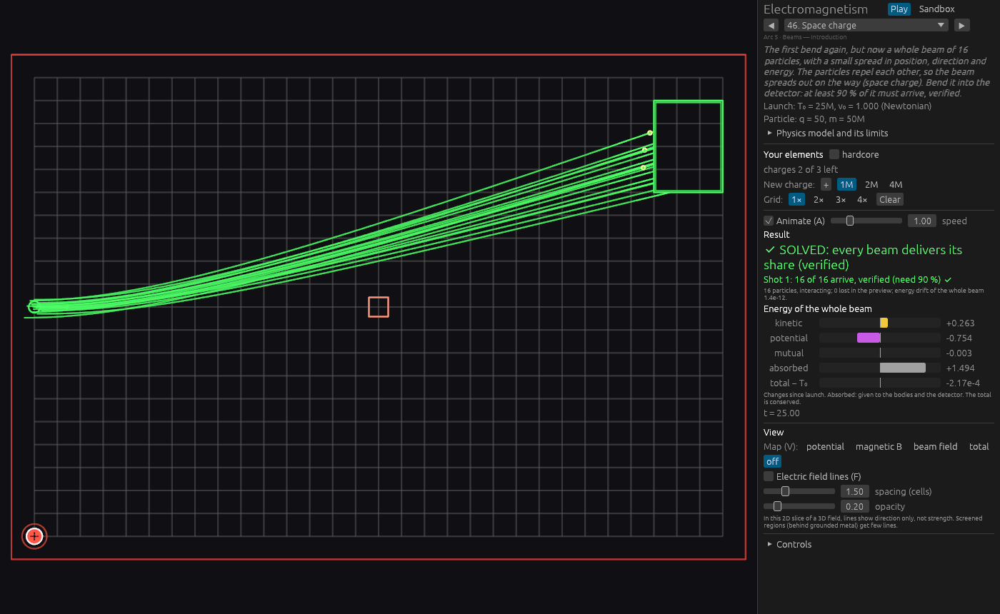

The same booking is on levels 49, 50, 51 and 56. This pass photographed level 46 only. The one-survivor illustration in `results/wolfram.txt` (kinetic energy 5.204×10⁻³ at t = 8, against a mutual energy 0.5 at entry) is the same force on an invented pair, not this beam.
